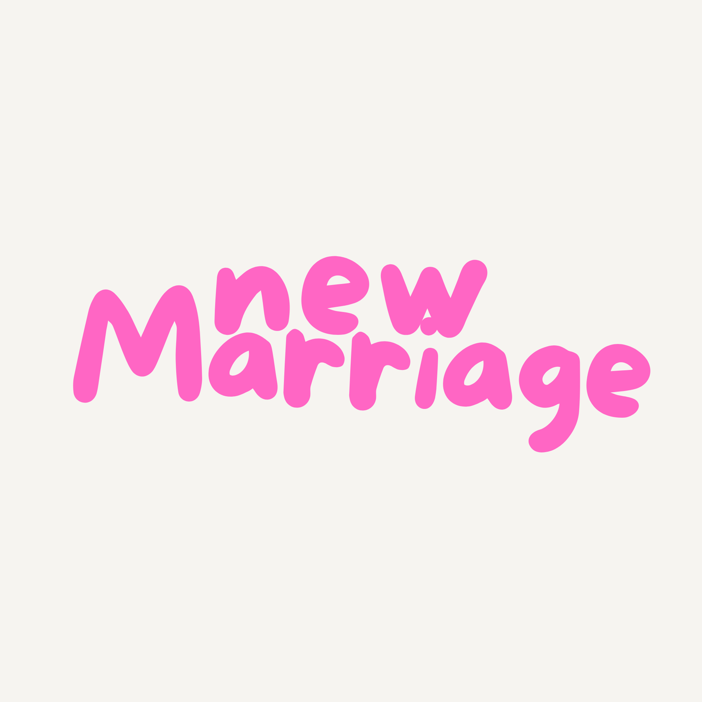

  

### Site **mobile-first** e 100% responsivo para casamentos.

---

## 📖 Sobre o Projeto
O **NewMarriage** é uma solução completa para casais que buscam praticidade. O projeto conta com:
* **Lista de Presentes:** Integração facilitada com PIX.
* **Gestão de Convidados:** Lista dinâmica organizada por módulos.
* **Dashboard:** Controle de presença visual (V=Verde / F=Vermelho).

## 🛠 Tecnologias

  
  
  
  
  
  
  
  
  

---

## 🖥 Telas
* **Home:** Banner, Nossa História, Presentes e Agradecimentos.
* **Login:** Acesso administrativo (`casamenteiro` / `12345678`). Feito em JS puro, facilmente modificável.
* **Lista de Convidados:** Adição por grupos (Família Noivo, Amigos, etc.), confirmação rápida e dashboard com métricas totais.

## 📸 Visualizações
> **Nota:** O layout é adaptativo e customizável para cada cliente.

## 🚀 Como Usar
1.  Clone o repositório.
2.  Abra o arquivo `index.html` diretamente no seu navegador.

**Pronto!** O projeto é totalmente funcional e não depende de banco de dados externo.

---

 

